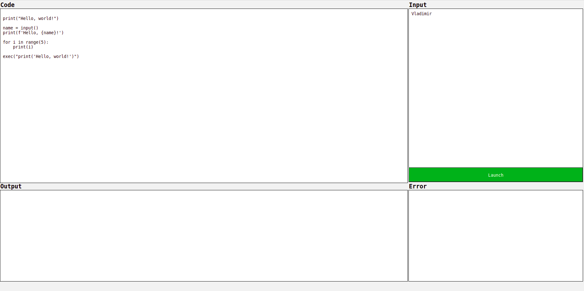

# EPAM final project
_______

## Executor of python code in browser
It's a web form with two input fileds ("Code" and "Input"). In the "Code" field we enter a file code. In the "Input" field we enter some input (if exists).

There is a "Launch" button. Pushing it execute the code on the server. After that, stdout and stderr will appear in the field "Output" and "Error". 

There are some specifications:
- The execution of pyhton code happens inside Docker container.
- In order to ensure security it prohibits to import **os** module and built-in functions **open, exec** and **eval**
- There is default timeout (5.0 s) for execution. 

### Run project
- Install [Docker](https://www.docker.com/)
- Download container image
```
docker pull guzvladimir/flask_browser_code_executor
```
- Run project
```
docker run -d -p <your port>:5000 guzvladimir/flask_browser_code_executor
```

